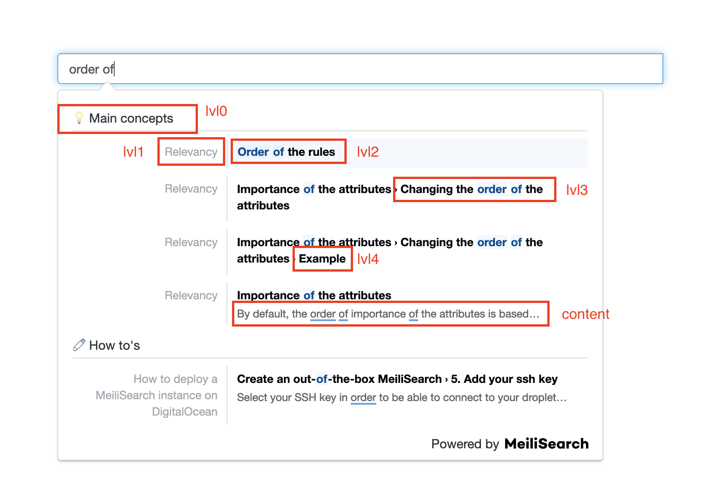

<p align="center">
  
</p>

<h1 align="center">docs-scraper</h1>

<h4 align="center">
  <a href="https://github.com/meilisearch/MeiliSearch">MeiliSearch</a> |
  <a href="https://docs.meilisearch.com">Documentation</a> |
  <a href="https://slack.meilisearch.com">Slack</a> |
  <a href="https://roadmap.meilisearch.com/tabs/1-under-consideration">Roadmap</a> |
  <a href="https://www.meilisearch.com">Website</a> |
  <a href="https://docs.meilisearch.com/faq">FAQ</a>
</h4>

<p align="center">
  <a href="https://github.com/meilisearch/docs-scraper/actions"></a>
  <a href="https://github.com/meilisearch/docs-scraper/blob/main/LICENSE"></a>
  <a href="https://app.bors.tech/repositories/28977"></a>
</p>

**docs-scraper** is a scraper for your documentation website that indexes the scraped content into a **MeiliSearch** instance.

**MeiliSearch** is an open-source search engine. [Discover what MeiliSearch is!](https://github.com/meilisearch/MeiliSearch)

This scraper is used in production and runs on the [MeiliSearch documentation](https://docs.meilisearch.com/) on each deployment.

💡 If you already have your own scraper but you still want to use MeiliSearch and our [front-end tools](#-and-for-the-front-end-search-bar), check out [this discussion](https://github.com/meilisearch/docs-searchbar.js/issues/40).

## Table of Contents <!-- omit in TOC -->

- [⚙️ Usage](#️-usage)
  - [Run your MeiliSearch Instance](#run-your-meilisearch-instance)
  - [Set your Config File](#set-your-config-file)
  - [Run the Scraper](#run-the-scraper)
- [🖌 And for the front-end search bar?](#-and-for-the-front-end-search-bar)
- [🛠 More Configurations](#-more-configurations)
  - [More About the Selectors](#more-about-the-selectors)
  - [All the Config File Settings](#all-the-config-file-settings)
    - [`index_uid`](#index_uid)
    - [`start_urls`](#start_urls)
    - [`stop_urls` (optional)](#stop_urls-optional)
    - [`selectors_key` (optional)](#selectors_key-optional)
    - [`scrape_start_urls` (optional)](#scrape_start_urls-optional)
    - [`sitemap_urls` (optional)](#sitemap_urls-optional)
    - [`sitemap_alternate_links` (optional)](#sitemap_alternate_links-optional)
    - [`selectors_exclude` (optional)](#selectors_exclude-optional)
    - [`custom_settings` (optional)](#custom_settings-optional)
    - [`min_indexed_level` (optional)](#min_indexed_level-optional)
    - [`only_content_level` (optional)](#only_content_level-optional)
    - [`js_render` (optional)](#js_render-optional)
    - [`js_wait` (optional)](#js_wait-optional)
    - [`allowed_domains` (optional)](#allowed_domains-optional)
  - [Authentication](#authentication)
  - [Installing Chrome Headless](#installing-chrome-headless)
- [🤖 Compatibility with MeiliSearch](#-compatibility-with-meilisearch)
- [⚙️ Development Workflow and Contributing](#️-development-workflow-and-contributing)
- [Credits](#credits)


## ⚙️ Usage

Here are the 3 steps to use `docs-scraper`:

1. [Run a MeiliSearch instance](#run-your-meilisearch-instance)
2. [Set your config file](#set-your-config-file)
3. [Run the scraper](#run-the-scraper)

### Run your MeiliSearch Instance

Your documentation content needs to be scraped and pushed into a MeiliSearch instance.

You can install and run MeiliSearch on your machine using `curl`.

```bash
curl -L https://install.meilisearch.com | sh
./meilisearch --master-key=myMasterKey
```

There are [other ways to install MeiliSearch](https://docs.meilisearch.com/learn/tutorials/getting_started.html#download-and-launch).

The host URL and the API key you will provide in the next steps correspond to the credentials of this MeiliSearch instance.
In the example above, the host URL is `http://localhost:7700` and the API key is `myMasterKey`.

_MeiliSearch is open-source and can run either on your server or on any cloud provider. Here is a tutorial to [run MeiliSearch in production](https://docs.meilisearch.com/running-production/)._


### Set your Config File

The scraper tool needs a config file to know which content you want to scrape. This is done by providing **selectors** (e.g. the HTML tag/id/class).

Here is an example of a basic config file:

```json
{
  "index_uid": "docs",
  "start_urls": ["https://www.example.com/doc/"],
  "sitemap_urls": ["https://www.example.com/sitemap.xml"],
  "stop_urls": [],
  "selectors": {
    "lvl0": {
      "selector": ".docs-lvl0",
      "global": true,
      "default_value": "Documentation"
    },
    "lvl1": {
      "selector": ".docs-lvl1",
      "global": true,
      "default_value": "Chapter"
    },
    "lvl2": ".docs-content .docs-lvl2",
    "lvl3": ".docs-content .docs-lvl3",
    "lvl4": ".docs-content .docs-lvl4",
    "lvl5": ".docs-content .docs-lvl5",
    "lvl6": ".docs-content .docs-lvl6",
    "text": ".docs-content p, .docs-content li"
  }
}
```
The `index_uid` field is the index identifier in your MeiliSearch instance in which your website content is stored. The scraping tool will create a new index if it does not exist.

The `docs-content` class (the `.` means this is a class) is the main container of the textual content in this example. Most of the time, this tag is a `<main>` or an `<article>` HTML element.

`lvlX` selectors should use the standard title tags like `h1`, `h2`, `h3`, etc. You can also use static classes. Set a unique id or name attribute to these elements.

Every searchable `lvl` elements outside this main documentation container (for instance, in a sidebar) must be `global` selectors. They will be globally picked up and injected to every document built from your page.

If your website is a VuePress application, you can check out the [config file](https://github.com/meilisearch/documentation/blob/master/.vuepress/docs-scraper/docs-scraper.config.json) we use in production.<br>
In our case, the main container is `theme-default-content` and the selector the titles and sub-titles are `h1`, `h2`...

💡 _To better understand the selectors, go to [this section](#more-about-the-selectors)._

🔨 _There are many other fields you can set in the config file that allow you to adapt the scraper to your need. Check out [this section](#all-the-config-file-settings)._

### Run the Scraper

#### From Source Code <!-- omit in TOC -->

This project supports Python 3.8 and above.

The [`pipenv` command](https://pipenv.readthedocs.io/en/latest/install/#installing-pipenv) must be installed.

Set both environment variables `MEILISEARCH_HOST_URL` and `MEILISEARCH_API_KEY`.<br>
Following on from the example in the [first step](#run-your-meilisearch-instance), they are respectively `http://localhost:7700` and `myMasterKey`.

Then, run:
```bash
pipenv install
pipenv run ./docs_scraper <path-to-your-config-file>
```

`<path-to-your-config-file>` should be the path of your configuration file defined at the [previous step](#set-your-config-file).

#### With Docker <!-- omit in TOC -->

```bash
docker run -t --rm \
    -e MEILISEARCH_HOST_URL=<your-meilisearch-host-url> \
    -e MEILISEARCH_API_KEY=<your-meilisearch-api-key> \
    -v <absolute-path-to-your-config-file>:/docs-scraper/config.json \
    getmeili/docs-scraper:latest pipenv run ./docs_scraper config.json
```

`<absolute-path-to-your-config-file>` should be the absolute path of your configuration file defined at the [previous step](#set-your-config-file).

⚠️ If you run MeiliSearch locally, you must add the `--network=host` option to this Docker command.

#### In a GitHub Action <!-- omit in TOC -->

To run after your deployment job:

```yml
run-scraper:
    needs: <your-deployment-job>
    runs-on: ubuntu-18.04
    steps:
    - uses: actions/checkout@master
    - name: Run scraper
      env:
        HOST_URL: ${{ secrets.MEILISEARCH_HOST_URL }}
        API_KEY: ${{ secrets.MEILISEARCH_API_KEY }}
        CONFIG_FILE_PATH: <path-to-your-config-file>
      run: |
        docker run -t --rm \
          -e MEILISEARCH_HOST_URL=$HOST_URL \
          -e MEILISEARCH_API_KEY=$API_KEY \
          -v $CONFIG_FILE_PATH:/docs-scraper/config.json \
          getmeili/docs-scraper:latest pipenv run ./docs_scraper config.json
```

⚠️ We do not recommend using the `latest` image in production. Use the [release tags](https://github.com/meilisearch/docs-scraper/releases) instead.

Here is the [GitHub Action file](https://github.com/meilisearch/documentation/blob/master/.github/workflows/gh-pages-scraping.yml) we use in production for the MeiliSearch documentation.

#### About the API Key <!-- omit in TOC -->

The API key you must provide should have the permissions to add documents into your MeiliSearch instance.<br>
In a production environment, we recommend providing the private key instead of the master key, as it is safer and it has enough permissions to perform such requests.

_More about [MeiliSearch authentication](https://docs.meilisearch.com/reference/features/authentication.html)._

## 🖌 And for the front-end search bar?

After having scraped your documentation, you might need a search bar to improve your user experience!

About the front part:
- If your website is a VuePress application, check out the [vuepress-plugin-meilisearch](https://github.com/meilisearch/vuepress-plugin-meilisearch) repository.
- For all kinds of documentation, check out the [docs-searchbar.js](https://github.com/meilisearch/docs-searchbar.js) library.

**Both of these libraries provide a front-end search bar perfectly adapted for documentation.**


## 🛠 More Configurations

### More About the Selectors

#### Bases <!-- omit in TOC -->

Very simply, selectors are needed to tell the scraper "I want to get the content in this HTML tag".<br>
This HTML tag is a **selector**.

A selector can be:

- a class (e.g. `.main-content`)
- an id (e.g. `#main-article`)
- an HTML tag (e.g. `h1`)

With a more concrete example:

```json
"lvl0": {
    "selector": ".navbar-nav .active",
    "global": true,
    "default_value": "Documentation"
},
```

`.navbar-nav .active` means "take the content in the class `active` that is itself in the class `navbar-nav`".

`global: true` means you want the same `lvl0` (so, the same main title) for all the contents extracted from the same page.

`"default_value": "Documentation"` will be the displayed value if no content in `.navbar-nav .active` was found.

NB: You can set the `global` and `default_value` attributes for every selector level (`lvlX`) and not only for the `lvl0`.

#### The Levels <!-- omit in TOC -->

You can notice different levels of selectors (0 to 6 maximum) in the config file. They correspond to different levels of titles, and will be displayed this way:



Your data will be displayed with a main title (`lvl0`), sub-titles (`lvl1`), sub-sub-titles (`lvl2`) and so on...

### All the Config File Settings

#### `index_uid`

The `index_uid` field is the index identifier in your MeiliSearch instance in which your website content is stored. The scraping tool will create a new index if it does not exist.

```json
{
  "index_uid": "example"
}
```

#### `start_urls`

This array contains the list of URLs that will be used to start scraping your website.<br>
The scraper will recursively follow any links (`<a>` tags) from those pages. It will not follow links that are on another domain.

```json
{
  "start_urls": ["https://www.example.com/docs"]
}
```
##### Using Page Rank <!-- omit in TOC -->

This parameter gives more weight to some pages and helps to boost records built from the page.<br>
Pages with highest `page_rank` will be returned before pages with a lower `page_rank`.

```json
{
  "start_urls": [
    {
      "url": "http://www.example.com/docs/concepts/",
      "page_rank": 5
    },
    {
      "url": "http://www.example.com/docs/contributors/",
      "page_rank": 1
    }
  ]
}
```

In this example, records built from the Concepts page will be ranked higher than results extracted from the Contributors page.

#### `stop_urls` (optional)

The scraper will not follow links that match `stop_urls`.

```json
{
  "start_urls": ["https://www.example.com/docs"],
  "stop_urls": ["https://www.example.com/about-us"]
}
```

#### `selectors_key` (optional)

This allows you to use custom selectors per page.

If the markup of your website is so different from one page to another that you can't have generic selectors, you can namespace your selectors and specify which set of selectors should be applied to specific pages.

```json
{
  "start_urls": [
    "http://www.example.com/docs/",
    {
      "url": "http://www.example.com/docs/concepts/",
      "selectors_key": "concepts"
    },
    {
      "url": "http://www.example.com/docs/contributors/",
      "selectors_key": "contributors"
    }
  ],
  "selectors": {
    "default": {
      "lvl0": ".main h1",
      "lvl1": ".main h2",
      "lvl2": ".main h3",
      "lvl3": ".main h4",
      "lvl4": ".main h5",
      "text": ".main p"
    },
    "concepts": {
      "lvl0": ".header h2",
      "lvl1": ".main h1.title",
      "lvl2": ".main h2.title",
      "lvl3": ".main h3.title",
      "lvl4": ".main h5.title",
      "text": ".main p"
    },
    "contributors": {
      "lvl0": ".main h1",
      "lvl1": ".contributors .name",
      "lvl2": ".contributors .title",
      "text": ".contributors .description"
    }
  }
}
```

Here, all documentation pages will use the selectors defined in `selectors.default` while the page under `./concepts` will use `selectors.concepts` and those under `./contributors` will use `selectors.contributors`.

#### `scrape_start_urls` (optional)

By default, the scraper will extract content from the pages defined in `start_urls`. If you do not have any valuable content on your starts_urls or if it's a duplicate of another page, you should set this to `false`.

```json
{
  "scrape_start_urls": false
}
```

#### `sitemap_urls` (optional)

You can pass an array of URLs pointing to your sitemap(s) files. If this value is set, the scraper will try to read URLs from your sitemap(s)

```json
{
  "sitemap_urls": ["http://www.example.com/docs/sitemap.xml"]
}
```

#### `sitemap_alternate_links` (optional)

Sitemaps can contain alternative links for URLs. Those are other versions of the same page, in a different language, or with a different URL. By default docs-scraper will ignore those URLs.

Set this to true if you want those other versions to be scraped as well.

```json
{
  "sitemap_urls": ["http://www.example.com/docs/sitemap.xml"],
  "sitemap_alternate_links": true
}
```

With the above configuration and the `sitemap.xml` below, both `http://www.example.com/docs/` and `http://www.example.com/docs/de/` will be scraped.

```html
<url>
  <loc>http://www.example.com/docs/</loc>
  <xhtml:link rel="alternate" hreflang="de" href="http://www.example.com/de/"/>
</url>
```

#### `selectors_exclude` (optional)

This expects an array of CSS selectors. Any element matching one of those selectors will be removed from the page before any data is extracted from it.

This can be used to remove a table of content, a sidebar, or a footer, to make other selectors easier to write.

```json
{
  "selectors_exclude": [".footer", "ul.deprecated"]
}
```

#### `custom_settings` (optional)

This field can be used to add MeiliSearch settings.

```json
"custom_settings": {
    "synonyms": {
      "static site generator": [
        "ssg"
      ],
      "ssg": [
        "static site generator"
      ]
    },
    "stopWords": ["of", "the"]
  },
```

##### Synonyms <!-- omit in TOC -->

The synonyms `SGG <=> Static Site Generator` allows the user to find all the results containing "Static Site Generator" with only typing "SSG" (and the opposite).
Here is the [dedicated page about synonyms](https://docs.meilisearch.com/reference/features/synonyms.html) in the official documentation.

##### Stop Words <!-- omit in TOC -->

Because your website might provide content with structured English sentences, we recommend adding stop words. Indeed, the search-engine would not be "spoiled" by linking words and would focus on the main words of the query, rendering more accurate results.<br>
Here is the [dedicated page about stop-words](https://docs.meilisearch.com/reference/features/stop_words.html) in the official documentation.<br>
You can find more complete lists of English stop-words [like this one](https://gist.github.com/sebleier/554280).


#### `min_indexed_level` (optional)

The default value is 0. By increasing it, you can choose not to index some records if they don't have enough `lvlX` matching. For example, with a `min_indexed_level: 2`, the scraper indexes temporary records having at least lvl0, lvl1 and lvl2 set.

This is useful when your documentation has pages that share the same `lvl0` and `lvl1` for example. In that case, you don't want to index all the shared records, but want to keep the content different across pages.

```json
{
  "min_indexed_level": 2
}
```

#### `only_content_level` (optional)

When `only_content_level` is set to `true`, then the scraper won't create records for the `lvlX` selectors.<br>
If used, `min_indexed_level` is ignored.

```json
{
  "only_content_level": true
}
```

#### `js_render` (optional)

When `js_render` is set to `true`, the scraper will use ChromeDriver. This is needed for pages that are rendered with JavaScript, for example, pages generated with React, Vue, or applications that are running in development mode: `autoreload` `watch`.

After installing ChromeDriver, provide the path to the bin using the following environment variable `CHROMEDRIVER_PATH` (default value is `/usr/bin/chromedriver`).

The default value of `js_render` is `false`.

```json
{
  "js_render": true
}
```

#### `js_wait` (optional)

This setting can be used when `js_render` is set to `true` and the pages need time to fully load. `js_wait` takes an integer is specifies the number of seconds the scraper should wait for the page to load.

```json
{
  "js_render": true,
  "js_wait": 1
}
```

#### `allowed_domains` (optional)

This setting specifies the domains that the scraper is allowed to access. In most cases the `allowed_domains` will be automatically set using the `start_urls` and `stop_urls`. When scraping a domain that contains a port, for example `http://localhost:8080`, the domain needs to be manually added to the configuration.

```json
{
  "allowed_domains": ["localhost"]
}
```

### Authentication

__WARNING:__ Please be aware that the scraper will send authentication headers to every scraped site, so use `allowed_domains` to adjust the scope accordingly!

#### Basic HTTP <!-- omit in TOC -->

Basic HTTP authentication is supported by setting these environment variables:
- `DOCS_SCRAPER_BASICAUTH_USERNAME`
- `DOCS_SCRAPER_BASICAUTH_PASSWORD`

#### Cloudflare Access: Identity and Access Management <!-- omit in TOC -->

If it happens to you to scrape sites protected by Cloudflare Access, you have to set appropriate HTTP headers.

Values for these headers are taken from env variables `CF_ACCESS_CLIENT_ID` and `CF_ACCESS_CLIENT_SECRET`.

In case of Google Cloud Identity-Aware Proxy, please specify these env variables:
- `IAP_AUTH_CLIENT_ID` - # pick [client ID of the application](https://console.cloud.google.com/apis/credentials) you are connecting to
- `IAP_AUTH_SERVICE_ACCOUNT_JSON` - # generate in [Actions](https://console.cloud.google.com/iam-admin/serviceaccounts) -> Create key -> JSON

#### Keycloak Access: Identity and Access Management <!-- omit in TOC -->

If you need to scrape site protected by [Keycloak](https://github.com/keycloak/keycloak) (Gatekeeper), you have to provide a valid access token.

If you set the environment variables `KC_URL`, `KC_REALM`, `KC_CLIENT_ID`, and `KC_CLIENT_SECRET` the scraper authenticates itself against Keycloak using _Client Credentials Grant_ and adds the resulting access token as `Authorization` HTTP header to each scraping request.

### Installing Chrome Headless

Websites that need JavaScript for rendering are passed through ChromeDriver.<br>
[Download the version](http://chromedriver.chromium.org/downloads) suited to your OS and then set the environment variable `CHROMEDRIVER_PATH`.

## 🤖 Compatibility with MeiliSearch

This package only guarantees the compatibility with the [version v0.20.0 of MeiliSearch](https://github.com/meilisearch/MeiliSearch/releases/tag/v0.20.0).

## ⚙️ Development Workflow and Contributing

Any new contribution is more than welcome in this project!

If you want to know more about the development workflow or want to contribute, please visit our [contributing guidelines](/CONTRIBUTING.md) for detailed instructions!

## Credits

Based on [Algolia's docsearch scraper repository](https://github.com/algolia/docsearch-scraper) from [this commit](https://github.com/curquiza/docsearch-scraper/commit/aab0888989b3f7a4f534979f0148f471b7c435ee).<br>
Due to a lot of future changes on this repository compared to the original one, we don't maintain it as an official fork.

<hr>

**MeiliSearch** provides and maintains many **SDKs and Integration tools** like this one. We want to provide everyone with an **amazing search experience for any kind of project**. If you want to contribute, make suggestions, or just know what's going on right now, visit us in the [integration-guides](https://github.com/meilisearch/integration-guides) repository.
